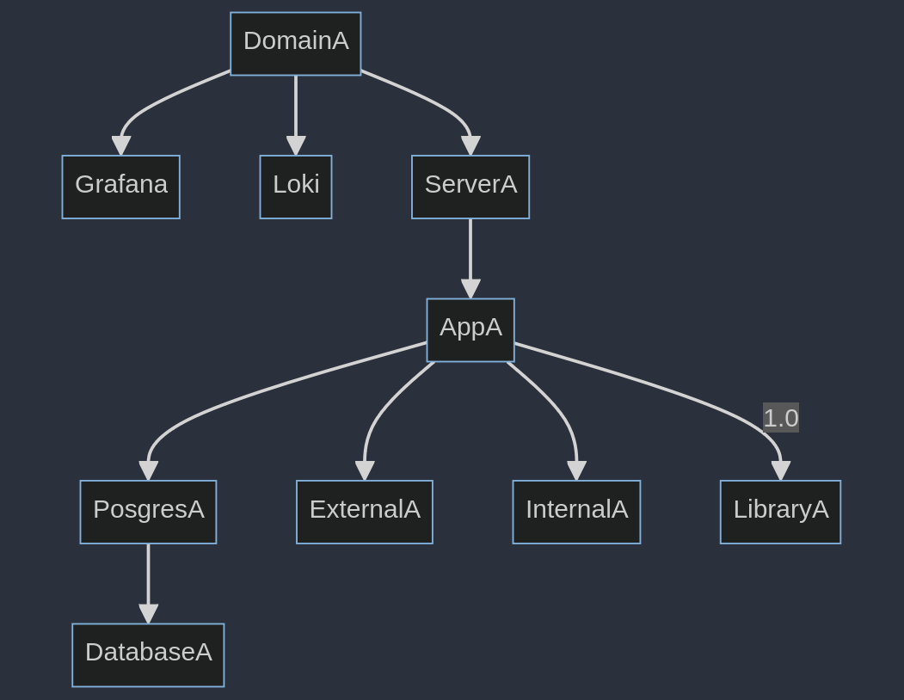

# DepthZ

A tool for analyzing git repos and correlating the depedencies between any related systems and libraries.

- Near-term goal: Export a textual graph of the systems and visualize it as a system map.
- Long-term goal: Correlate the graph with actual systems and do realtime analysis.

## Track Dependencies

Everything starts in a DEPTHZ file. See [Specification](./SPECIFICATION.md).

- Domains (aka service areas)
- Library, database, service, server relationships (aka deps)

## Mermaid Example

Creating a system dependency chart would be useful.

```
---
title: Service Area
---
flowchart TB
    DomainA --> ServerA
    DomainA --> ServerB
    ServerA --> NomadA
         NomadA --> AppA & AppB
    ServerB --> NomadB
         NomadB --> AppA & AppB
    AppA --> PostgresA --> DatabaseA
    AppA --> ExternalA & InternalA & LibraryA
    AppB --> PostgresA --> DatabaseB
    AppB --> CacheA & LibraryA
```


